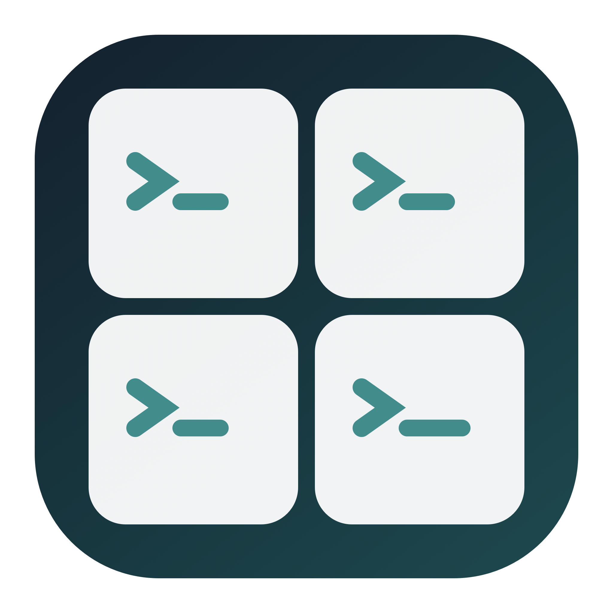

<div align="center">
  
  <h1>TermYes</h1>
  <p><strong>Your terminals, together. Risky commands, stopped.</strong></p>
  <p>A native macOS menu-bar utility for Apple Terminal and Agent command guards.</p>
  <p>
    <a href="https://github.com/zzusec/Termosaic/actions/workflows/build.yml"></a>
    
    
  </p>
  <p><strong>English</strong> · <a href="README.zh-CN.md">简体中文</a></p>
  <p><a href="https://github.com/zzusec/Termosaic/releases/latest">Download</a> · <a href="RELEASE_NOTES.md">Release notes</a> · <a href="AgentGuard/README.md">Guard details</a></p>
</div>

TermYes brings **Termosaic's terminal canvas** and **bypass-yes's command guards** into one application. Keep existing Terminal sessions visible together, hide them without stopping their processes, and manage per-Agent shell guards from the menu bar.

> **“Yes” is not unconditional approval.** This release hard-denies commands matching danger/warning rules, but does **not** enable YOLO or auto-approve native permission requests. All thirteen adapters still require real-client end-to-end validation. Existing client permission settings remain unchanged.

## What it does

- **One terminal canvas.** Tile Apple's Terminal windows edge to edge: four windows form a 2×2 grid; six form a 3×2 grid. New and closed windows trigger re-layout, with stable clockwise ordering.
- **Less desktop clutter.** Show or hide the canvas together, including minimized windows, while processes keep running. No Dock icon, embedded shell, or permanent control window; other applications' windows are not rearranged.
- **Keyboard access.** A configurable global shortcut brings the canvas back. The default is `⌘O`; change it if you need to preserve another application's Open command.
- **Conservative task recovery.** Scheduled `继续` attempts recognize selected quota/network interruptions. Recognized confirmation prompts, guard denials, passwords, and unknown automatic-resume states are skipped. TermYes never automatically types `yes`.
- **One place for command guards.** Install/update or restore a client's guard from the menu, without changing its permission mode, model settings, shell aliases, or sandbox settings.
- **In-app updates.** Download versioned release images, verify checksums and application signatures, then replace and relaunch with a backup for recovery.

## Install

Requires **macOS 13+**, on Apple Silicon or Intel.

1. Download **`TermYes-v1.4.0-macOS.dmg`** from [GitHub Releases](https://github.com/zzusec/Termosaic/releases/latest).
2. Open it and drag **TermYes.app** to **Applications**.
3. Launch TermYes and allow it to control Terminal when requested:
   **System Settings → Privacy & Security → Automation → TermYes → Terminal**.
4. Use the menu-bar grid icon to show the terminal canvas.

The community build is ad-hoc signed, not Apple-notarized. If macOS blocks first launch, use its per-application **Open Anyway** workflow only if you trust this release. Do not disable system-wide security protections.

Window management needs no Python or Node.js. The **optional guard module** needs a working `/usr/bin/python3`, provided on the development machine by Xcode Command Line Tools. TermYes does not install dependencies automatically. Online updates need internet access.

### Upgrading from Termosaic

TermYes is the new product name; the GitHub repository remains **`zzusec/Termosaic`** so existing update URLs continue working.

- The bundle identifier, saved preferences, guard runtime directories, and restore records retain their existing identifiers. The rename does not intentionally reset them; macOS may still request automation permission again.
- Releases include a **`Termosaic-v1.4.0-macOS.dmg` compatibility image** for older updaters, alongside the main TermYes image. Both contain the same signed TermYes application under the bundle name that the corresponding updater expects.
- An automatic upgrade can keep the installed folder named `Termosaic.app` while the app displays **TermYes**. Do not run the old and new copies simultaneously.
- Guard installation does not delete the old bypass-yes checkout. Newly installed runtime files no longer depend on that checkout.

## Use the canvas

| Menu action | Shortcut |
| --- | --- |
| Show/hide terminal canvas | `⌥⌘1` |
| Re-tile on the display under the pointer | `⌥⌘2` |
| Attempt one manual `继续` pass | `⌥⌘3` |
| Show and re-tile globally | `⌘O` by default; configurable |

Switching to another application hides the canvas. Hiding windows does not stop the processes inside them. TermYes manages **Apple's Terminal.app only**, not iTerm2 or other terminal emulators.

Automatic continue is enabled by default at a 30-minute interval. The **自动“继续”** submenu offers intervals of 5–120 minutes, session scope, and an optional five-hour schedule anchored to a chosen time. The default scope matches `Codex`/`Claude` in the window title or process list.

Screen-text recognition is a heuristic, not a reliable session-state API. It can miss prompts or pause unnecessarily, and cannot guarantee recovery from crashes. Be especially careful with manual sends to **all Terminal windows**: an ordinary shell can interpret `继续` as a command.

## Agent command guards

Open **Agent 命令守卫 → 检测守卫配置**, then choose a client. **Quit that client before installing/updating or restoring its files**, and restart afterward. Codex also requires checking and trusting the new hooks in `/hooks`.

Bundled adapters cover Claude Code, Codex, CodeBuddy, zcode, pi, Qoder, Gemini CLI, Cursor, agy, OpenCode, Factory droid, Crush, and GitHub Copilot CLI.

### Policy and current status

| Situation | TermYes behavior |
| --- | --- |
| Command matches a danger or warning rule | Deny; do not ask for confirmation |
| Invalid input or a caught guard/bridge failure | Return a denial, not a silent allow |
| No danger rule matches | Leave the client's existing permission flow in charge |
| Client has not passed real-client validation | Do not enable automatic approval |
| Files changed after TermYes installed them | Refuse automatic overwrite/restore |

**Installed is not the same as protected.** Every adapter is currently unverified at the real-client level. Copilot's host timeout behavior and agy's turbo behavior have known or unresolved compatibility concerns. Loading, trust, disabled hooks, or host timeouts may prevent a guard from taking effect.

These are **shell-text accident guards, not a sandbox**. They do not fully understand arbitrary Python, SQL, remote programs, aliases, or script contents, and do not intercept separate file-editing or MCP tools. A `safe` result means “no rule matched,” not “proved safe.”

Installation merges default user-level client configurations, preserves unrelated hooks, and keeps private restore records. Existing YOLO settings are neither enabled nor disabled. Custom configuration roots and project-level configurations are not managed. See [guard documentation](AgentGuard/README.md) for paths, failure behavior, and CLI usage.

## Build and test

Building requires Xcode Command Line Tools. Guard tests use Python; plugin tests require an existing Node.js with `node:module.stripTypeScriptTypes` support. CI uses Node.js 24.

```sh
# Build without replacing an installed app.
SKIP_INSTALL=1 ./build.sh

# Produce main and legacy-compatible DMGs plus portable SHA-256 files.
./create-dmg.sh
/usr/bin/python3 -B Tests/test_release.py
```

The app is written to `build/TermYes.app`; images and checksums go to `dist/`. Running `./build.sh` **without** `SKIP_INSTALL=1` installs into `/Applications/TermYes.app`.

```sh
PYTHONDONTWRITEBYTECODE=1 /usr/bin/python3 -B Tests/test_agent_guard.py
bash AgentGuard/test.sh
PYTHONDONTWRITEBYTECODE=1 bash AgentGuard/test-codex.sh
node Tests/test_guard_plugins.mjs
swiftc Sources/TerminalResumePolicy.swift Tests/TerminalResumeTests.swift -o /tmp/termyes-resume-tests
/tmp/termyes-resume-tests
swiftc Sources/GridLayout.swift Tests/main.swift -o /tmp/termyes-grid-tests
/tmp/termyes-grid-tests
swiftc Sources/SemanticVersion.swift Tests/VersionTests.swift -o /tmp/termyes-version-tests
/tmp/termyes-version-tests
bash Tests/test_update_installer.sh
```

Guard tests classify command strings without executing them. Plugin tests mock host APIs; passing them is not real-client YOLO certification. Release tests mount images read-only and exercise the updater on temporary copies without launching the app.

## Updates, privacy, and license

TermYes checks public GitHub Releases shortly after launch and every six hours. Automatic replacement requires an installation under `/Applications` and permission to write there. Checksums and strict recursive `codesign` verification detect corrupted or inconsistent packages; ad-hoc signing is not an Apple developer-identity guarantee.

No analytics, accounts, advertising, or telemetry. App network access is used for public release checks/downloads. Guard installation and Terminal automation are local. Restore records may include sensitive values from existing client configurations; do not share them.

[MIT](LICENSE). The migrated command-guard module retains its [original MIT license](AgentGuard/LICENSE).
